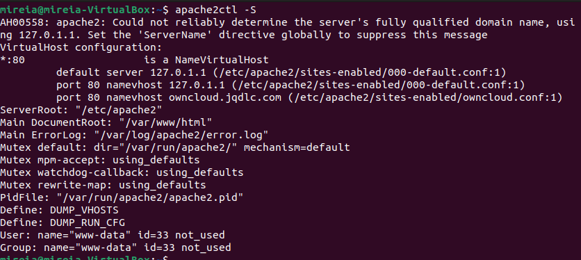

# Activitat 3

**3.1.-** Llista els Virtual Hosts d'Apache per tal de veure si owncloud.XYZ.com està habilitat amb la comanda:

`apache2ctl -S`

**3.2.-** A Owncloud podem veure que hi ha una serie de carpetes per defecte, mostra la ruta real a les tres carpetes dins de la teva MV.

`/var/www/html/owncloud/data/(username)/files`

**3.3.-** Al directori Learn more about owncloud hi ha informació en forma de fitxers pdf. Consulta'ls i respon aquestes preguntes:
